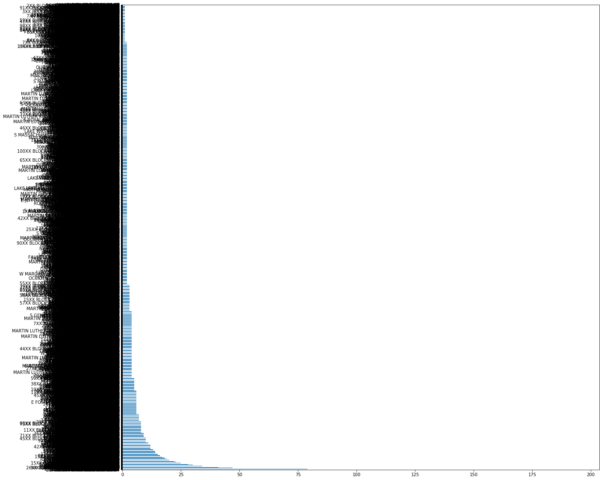
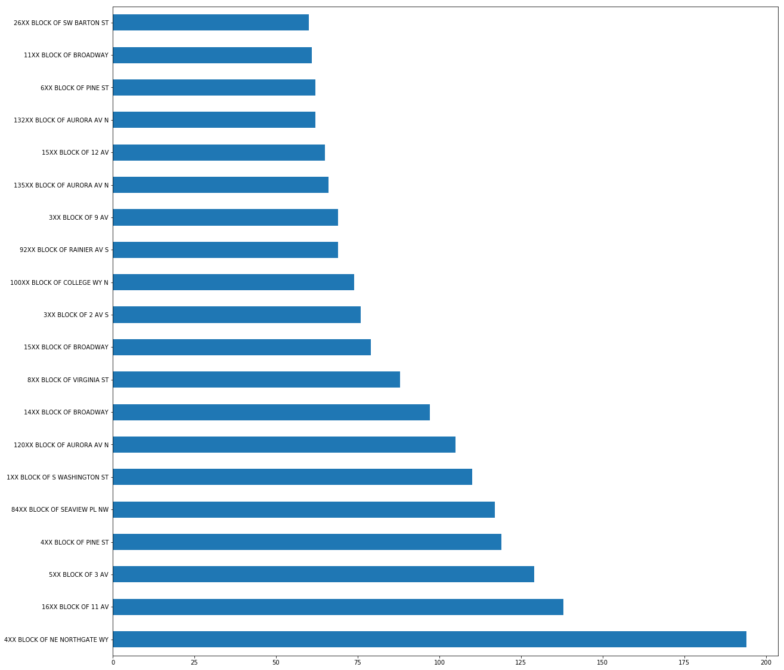
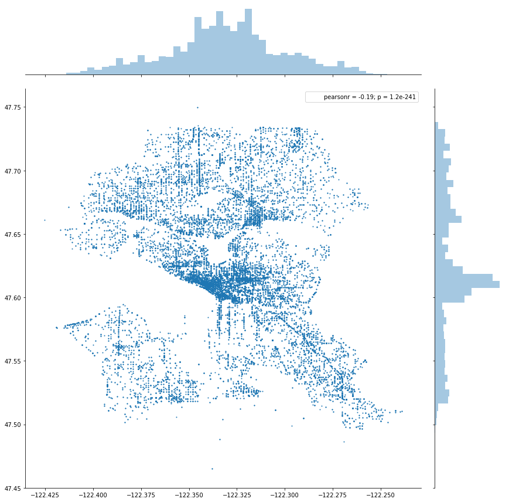
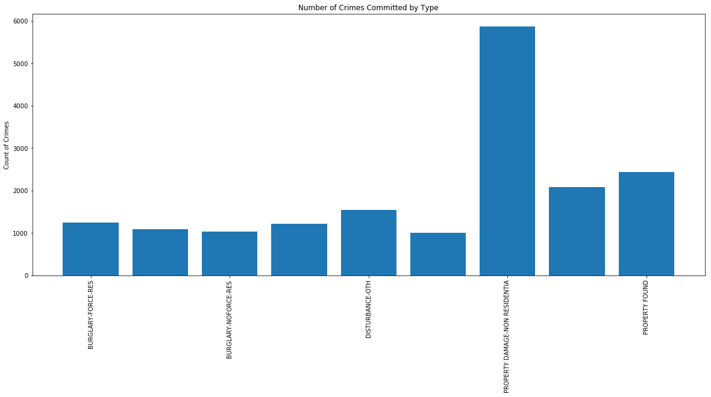
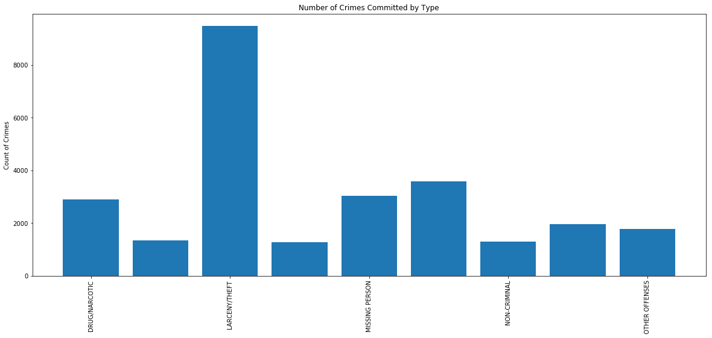

# Crime Analytics: Visualization of Incident Reports

## Introduction

The crime analytics data set was provided to me by the Coursera Course, "Communicating Data Science Results", and requires that I apply the techniques learned in the first week. The purpose of this course is to ensure that I can not only use data science to glean information, but also visually display it in a way that everyone can understand.
To do this I intend to compare and contrast the two cities, San Fransisco and Seattle. I will do a comparrison of the differnt times of day the crimes occur at, where, what kinds, and see if there are any other interesting facts or trends that are visually apparent.

## Loading the Data

The first step is to load the data into my notebook, I will be using panda's, and getting some basic understanding of what kinds of categories I can expect to find.


```python
import pandas as pd
import seaborn as sns
color = sns.color_palette()
%matplotlib inline
import numpy as np
import matplotlib.pyplot as plt

df_Seattle = pd.read_csv("C:/Users/Nicholas/Documents/datasci_course_materials/assignment6/seattle_incidents_summer_2014.csv")
df_SanFran = pd.read_csv("C:/Users/Nicholas/Documents/datasci_course_materials/assignment6/sanfrancisco_incidents_summer_2014.csv")

print("Total data in Seattle ", len(df_Seattle))
print("Total data in San Fransisco ", len(df_SanFran))

```

    ('Total data in Seattle ', 32779)
    ('Total data in San Fransisco ', 28993)
    


```python
df_Seattle.head()
```


<div>
<table border="1" class="dataframe">
  <thead>
    <tr style="text-align: right;">
      <th></th>
      <th>RMS CDW ID</th>
      <th>General Offense Number</th>
      <th>Offense Code</th>
      <th>Offense Code Extension</th>
      <th>Offense Type</th>
      <th>Summary Offense Code</th>
      <th>Summarized Offense Description</th>
      <th>Date Reported</th>
      <th>Occurred Date or Date Range Start</th>
      <th>Occurred Date Range End</th>
      <th>Hundred Block Location</th>
      <th>District/Sector</th>
      <th>Zone/Beat</th>
      <th>Census Tract 2000</th>
      <th>Longitude</th>
      <th>Latitude</th>
      <th>Location</th>
      <th>Month</th>
      <th>Year</th>
    </tr>
  </thead>
  <tbody>
    <tr>
      <th>0</th>
      <td>483839</td>
      <td>2015218538</td>
      <td>2202</td>
      <td>0</td>
      <td>BURGLARY-FORCE-RES</td>
      <td>2200</td>
      <td>BURGLARY</td>
      <td>06/28/2015 10:31:00 AM</td>
      <td>06/28/2014 10:31:00 AM</td>
      <td>06/28/2015 10:31:00 AM</td>
      <td>6XX BLOCK OF NW 74 ST</td>
      <td>J</td>
      <td>J2</td>
      <td>2900.3013</td>
      <td>-122.364672</td>
      <td>47.682524</td>
      <td>(47.68252427, -122.364671996)</td>
      <td>6</td>
      <td>2014</td>
    </tr>
    <tr>
      <th>1</th>
      <td>481252</td>
      <td>2015213067</td>
      <td>2610</td>
      <td>0</td>
      <td>FRAUD-IDENTITY THEFT</td>
      <td>2600</td>
      <td>FRAUD</td>
      <td>06/24/2015 11:09:00 AM</td>
      <td>06/01/2014 12:00:00 AM</td>
      <td>06/24/2015 11:09:00 AM</td>
      <td>23XX BLOCK OF 43 AV E</td>
      <td>C</td>
      <td>C2</td>
      <td>6300.1004</td>
      <td>-122.277080</td>
      <td>47.639901</td>
      <td>(47.639900761, -122.277080248)</td>
      <td>6</td>
      <td>2014</td>
    </tr>
    <tr>
      <th>2</th>
      <td>481375</td>
      <td>2015210301</td>
      <td>2316</td>
      <td>0</td>
      <td>THEFT-MAIL</td>
      <td>2300</td>
      <td>MAIL THEFT</td>
      <td>06/22/2015 09:22:00 AM</td>
      <td>08/31/2014 09:00:00 AM</td>
      <td>NaN</td>
      <td>81XX BLOCK OF 11 AV SW</td>
      <td>F</td>
      <td>F3</td>
      <td>11300.5013</td>
      <td>-122.349312</td>
      <td>47.529232</td>
      <td>(47.529232299, -122.349312181)</td>
      <td>8</td>
      <td>2014</td>
    </tr>
    <tr>
      <th>3</th>
      <td>481690</td>
      <td>2015209327</td>
      <td>2599</td>
      <td>0</td>
      <td>COUNTERFEIT</td>
      <td>2500</td>
      <td>COUNTERFEIT</td>
      <td>06/21/2015 03:52:00 PM</td>
      <td>06/20/2014 01:38:00 PM</td>
      <td>NaN</td>
      <td>6XX BLOCK OF PINE ST</td>
      <td>M</td>
      <td>M2</td>
      <td>8200.1002</td>
      <td>-122.334818</td>
      <td>47.612368</td>
      <td>(47.612368448, -122.334817763)</td>
      <td>6</td>
      <td>2014</td>
    </tr>
    <tr>
      <th>4</th>
      <td>478198</td>
      <td>2015207880</td>
      <td>2399</td>
      <td>3</td>
      <td>THEFT-OTH</td>
      <td>2300</td>
      <td>OTHER PROPERTY</td>
      <td>06/20/2015 11:59:00 AM</td>
      <td>06/01/2014 11:59:00 AM</td>
      <td>11/01/2014 12:00:00 PM</td>
      <td>77XX BLOCK OF SUNNYSIDE AV N</td>
      <td>J</td>
      <td>J3</td>
      <td>2700.2015</td>
      <td>-122.329379</td>
      <td>47.685960</td>
      <td>(47.685959879, -122.329378505)</td>
      <td>6</td>
      <td>2014</td>
    </tr>
  </tbody>
</table>
</div>


```python
df_SanFran.head()
```


<div>
<table border="1" class="dataframe">
  <thead>
    <tr style="text-align: right;">
      <th></th>
      <th>IncidntNum</th>
      <th>Category</th>
      <th>Descript</th>
      <th>DayOfWeek</th>
      <th>Date</th>
      <th>Time</th>
      <th>PdDistrict</th>
      <th>Resolution</th>
      <th>Address</th>
      <th>X</th>
      <th>Y</th>
      <th>Location</th>
      <th>PdId</th>
    </tr>
  </thead>
  <tbody>
    <tr>
      <th>0</th>
      <td>140734311</td>
      <td>ARSON</td>
      <td>ARSON OF A VEHICLE</td>
      <td>Sunday</td>
      <td>08/31/2014</td>
      <td>23:50</td>
      <td>BAYVIEW</td>
      <td>NONE</td>
      <td>LOOMIS ST / INDUSTRIAL ST</td>
      <td>-122.405647</td>
      <td>37.738322</td>
      <td>(37.7383221869053, -122.405646994567)</td>
      <td>14073431126031</td>
    </tr>
    <tr>
      <th>1</th>
      <td>140736317</td>
      <td>NON-CRIMINAL</td>
      <td>LOST PROPERTY</td>
      <td>Sunday</td>
      <td>08/31/2014</td>
      <td>23:45</td>
      <td>MISSION</td>
      <td>NONE</td>
      <td>400 Block of CASTRO ST</td>
      <td>-122.435012</td>
      <td>37.761768</td>
      <td>(37.7617677182954, -122.435012093789)</td>
      <td>14073631771000</td>
    </tr>
    <tr>
      <th>2</th>
      <td>146177923</td>
      <td>LARCENY/THEFT</td>
      <td>GRAND THEFT FROM LOCKED AUTO</td>
      <td>Sunday</td>
      <td>08/31/2014</td>
      <td>23:30</td>
      <td>SOUTHERN</td>
      <td>NONE</td>
      <td>1000 Block of MISSION ST</td>
      <td>-122.409795</td>
      <td>37.780036</td>
      <td>(37.7800356268394, -122.409795194505)</td>
      <td>14617792306244</td>
    </tr>
    <tr>
      <th>3</th>
      <td>146177531</td>
      <td>LARCENY/THEFT</td>
      <td>GRAND THEFT FROM LOCKED AUTO</td>
      <td>Sunday</td>
      <td>08/31/2014</td>
      <td>23:30</td>
      <td>RICHMOND</td>
      <td>NONE</td>
      <td>FULTON ST / 26TH AV</td>
      <td>-122.485263</td>
      <td>37.772518</td>
      <td>(37.7725176473142, -122.485262988324)</td>
      <td>14617753106244</td>
    </tr>
    <tr>
      <th>4</th>
      <td>140734220</td>
      <td>NON-CRIMINAL</td>
      <td>FOUND PROPERTY</td>
      <td>Sunday</td>
      <td>08/31/2014</td>
      <td>23:23</td>
      <td>RICHMOND</td>
      <td>NONE</td>
      <td>800 Block of LA PLAYA ST</td>
      <td>-122.509895</td>
      <td>37.772313</td>
      <td>(37.7723131976814, -122.509895418239)</td>
      <td>14073422072000</td>
    </tr>
  </tbody>
</table>
</div>


I've loaded my data in, and I can see the different columns avaliable in each of the cases. The two cities offer pretty different types of data; and also in different formats. For the Seattle data set the first two columns are unique identifiers, I don't believe I will need more than one. There are also a date start/end but the last two columns are month/year. I will eliminate the redundant columns.
For the San Fran data set the location column is also redundant - it has the same information that the X/Y columns contain, only in a condensed form. This is more difficult to interpret/parse then the already separated lat/long coordinates.


```python
df_Seattle = df_Seattle.drop(["RMS CDW ID","Month","Year"],axis=1)
df_SanFran = df_SanFran.drop(["Location"],axis=1)
```

## Seattle

I would like to see if I can see where in the city various different crimes have occured, and if there is a pattern! I will do a count of locations and plot a bar chart first - and then plot a map of the city (lat/long).


```python
seattle_dates = df_Seattle["Occurred Date or Date Range Start"]
loc = df_Seattle["Hundred Block Location"]
a = df_Seattle.groupby(["Hundred Block Location"]).size().reset_index(name='Counts')
# only plot if there were over 20 counts
a = a[a['Counts'] > 20]
print(len(a))
```

    162
    

This is still too large of a number to plot on a bar chart if I hope to present any kind of detail. I will filter the data to only show the top 20 occurances, it should also allow a proper bar chart with labels to be displayed. I've included an example of just how difficult it can be to see any kind of information with this much data present.


```python
df_Seattle['Hundred Block Location'].value_counts().plot(kind='barh', figsize=(20,20))
```


    <matplotlib.axes._subplots.AxesSubplot at 0x14bd6f98>





```python
df_Seattle['Hundred Block Location'].value_counts()[:20].plot(kind='barh', figsize=(20,20))
```


    <matplotlib.axes._subplots.AxesSubplot at 0x3e2ba128>





The block with the most crimes in it is the 400 block of NE Northgate Way. The bar chart illustrates just how much more crime there is in that block compared to the others - even when only compared to the other most crime ridden areas. With the reduced number of items in the bar chart it becomes extremely easy to see where the crimes are being committed. This kind of graphic is interesting and informative in that it tells us places to avoid in Seattle, or areas in the city you may not want to buy in.

Next I want to see if there is a pattern on a more general basis - since I have been given latitude and longitude I will plot based on that.


```python
#remove the outlying position (0,0)
df_Seattle = df_Seattle[df_Seattle["Latitude"] > 0]

g = sns.jointplot(x = df_Seattle.Longitude.values, y=df_Seattle.Latitude.values, size=12,s=1)

```





It should come as no surprise that the largest concentration of crime is around the city centre. This is where most cities have the highest crime rate (as they also have the highest number of people living there). Another interesting features is the ability to see city blocks, they are the lines where data occurs straight N/S - just south of city centre.

## Types Of Crimes
Now that we know where crimes are being committed in Seattle let's compare that to what kind of crimes are being committed in both Seattle and San Fransisco.


```python
Seattle_types = df_Seattle.groupby(["Offense Type"]).size().reset_index(name="Counts")
print(Seattle_types.max())

SanFran_types = df_SanFran.groupby(["Category"]).size().reset_index(name="Counts")
print(SanFran_types.max())
```

    Offense Type    [INC - CASE DC USE ONLY]
    Counts                              5878
    dtype: object
    Category    WEAPON LAWS
    Counts             9466
    dtype: object
    

Again I want to plot a bar chart of both Seattle and then San Fransisco after. This will let me see just how much higher these numbers are then the other crimes being committed.


```python
Seattle_types = Seattle_types[Seattle_types["Counts"]>1000]

fig = plt.figure(figsize=(20,8))
ax = plt.subplot(111)
ax.bar(range(len(Seattle_types['Counts'])), Seattle_types["Counts"])
ax.set_title("Number of Crimes Committed by Type")
ax.set_ylabel("Count of Crimes")
ax.set_xticklabels(Seattle_types["Offense Type"], rotation=90)
fig.show()
```

    C:\Users\Nicholas\Anaconda2\lib\site-packages\matplotlib\figure.py:403: UserWarning: matplotlib is currently using a non-GUI backend, so cannot show the figure
      "matplotlib is currently using a non-GUI backend, "
    





```python
SanFran_types = SanFran_types[SanFran_types["Counts"]>1000]

fig = plt.figure(figsize=(20,8))
ax = plt.subplot(111)
ax.bar(range(len(SanFran_types['Counts'])), SanFran_types["Counts"])
ax.set_title("Number of Crimes Committed by Type")
ax.set_ylabel("Count of Crimes")
ax.set_xticklabels(SanFran_types["Category"], rotation=90)
fig.show()
```





So we can see that clearly the largest types of crime in Seattle are property crimes, breaking and entering, property damage, etc. and in San Fransisco it is mostly theft and drug related. Very quickly we can do some math to see what the percentage of crimes committed belong to these top crimes.

Recall that in the San Fransisco dataset we had 28993. So larceny/theft make up a huge 33% of the crime reported by police! That is a massive percentage.
In comparrison the Seattle dataset had 32779 points, so the largest crime - property damage - makes up only 18%. Obviously the crime is much more diverse in Seattle than San Fransisco.

## Conclusion
Crime in any city is always a problem, and understanding what kinds of offenses are occuring and where can help police to run programs that combat crime before it happens. This blog post was a simple analysis into where and what type of crime was committed.
